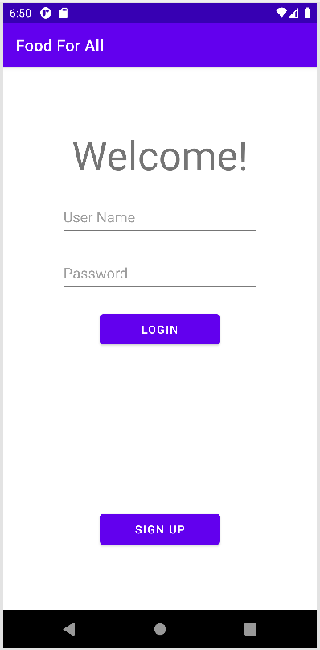
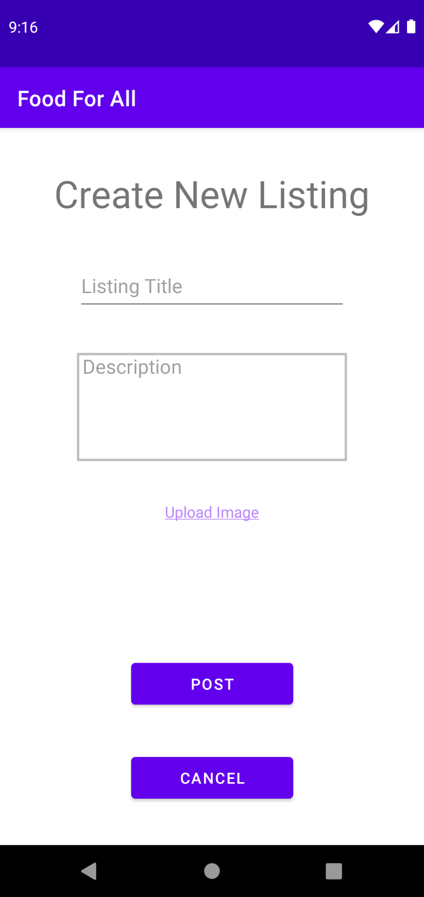

# Food For All

## Implemented by:

*   Kieran Devany - devanyk2@wwu.edu
*   Jamal Marri - jamal@marri.dev
*   Jorell de Vera - deveraj@wwu.edu
*   Ayisha Olanrewaju - olanrea@wwu.edu

### CS 412, Winter 2021, Dr. Shameem Ahmed

## Purpose

The purpose of this app is to reduce food waste by connecting those with excess food to those in need.

## Features

Our app uses the following features to provide an excellent experience to our nonexistent customers: multiple screens, a menu, a Firebase Firestore database, the system camera, GPS, Google Maps, and Fragments.

## Market Analysis

*   [YourLocal](https://yourlocal.org/) 
*   [FoodRescue](https://foodrescue.us/)
*   [Food Banks USA](https://play.google.com/store/apps/details?id=com.free.food)
*   [Food Finder](https://play.google.com/store/apps/details?id=org.foodfinderga.foodfinder)
*   [ShareTheMeal](https://sharethemeal.org/en)
*   [FoodConnect](https://www.foodconnectgroup.com/)
*   [Got Food](https://play.google.com/store/apps/details?id=com.us.gotfood&hl=en_US&gl=US)
*   [Waste No Food](https://play.google.com/store/apps/details?id=org.wastenofood.app&hl=en_US&gl=US)

Through our research of these apps we discovered that there is not only a market for reducing waste but also for charities and other organizations to coordinate food rescues.

## App Evolution

*   Checkpoint 1

    Our primary focus for checkpoint 1 was to set up our development environment, mainly our database solution, and to develop our method of contribution. The end result is basic login and registration activities that will connect to firebase for authentication.\
    {:style="width:50%"}

*   Checkpoint 2

    The next stage was to add functionality to the application in the form of a listing creation page and an organization registration page. This stage also dealt with asking for camera permissions and taking photos. We also connected our registration/login activities to Firebase Authentication.\
    {:style="width:50%"}
*   Checkpoint 3

    We integrated Google Maps using a Fragment, which means we now have a key component of our listing feed activity. We have also integrated the Firebase Firestore database to add new listings.\
    {:style="width:50%"}

*   Checkpoint 4

    We now have location services which integrate with the map to display the location of listings in relation to the user's current location. Our app additionally allows a user to filter and view specific listings. Users can now register as an organization and organizations can also now edit and modify listings that they have created.\
    {:style="width:50%"}

*   Checkpoint 5

    Organizations can now delete their listings and modify their details/image. Users can now sort listings in the feed by date posted and distance to their current location. All existing features were polished and made much more stable. All of the app's source code was refactored to be much more efficient. Additionally, the app theme has been customized and a logo has been produced for the launcher.\
    {:style="width:50%"}

## Final Project

*   Model

    Our model consists of multiple Firebase services including: Firestore, Storage, and Authentication. Our model also includes the Java classes which manage Firestore and Storage access, as well as a Listing class to serve as a representation of a single Listing.

*   Controller

    Our controller consists of our activity Java classes which control each activity’s view, as well as a class managing Toasts and an interface for callback methods.

*   View

    Our view consists of our activity XML files, as well as the Java classes which we extend for most of our activities, each representing a common feature among them.

*   Final Version

    Our app allows for email/password registration/login. Upon logging into the app, the user is presented with a feed of listings posted by organizations that have registered to become food donators. Users may sort the feed by date posted or by distance to them. They may also filter by distance to narrow down their results. Users may click on a listing to see more details about it. When looking at a particular listing, users can see the details of the organization that posted it by clicking on their name. In the profile page, a user may log out of the app or register as an organization themselves. Upon registering as an organization, the user’s profile page will change to include options where they can modify their organization’s details and manage their existing listings. Additionally, the create button will be accessible from the feed page, which users can use to create new listings.

### Check us out [here](https://github.com/wwu-ffa/food-for-all)
